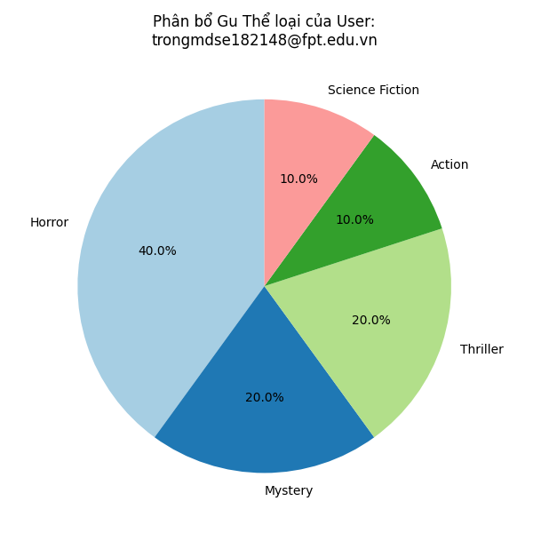
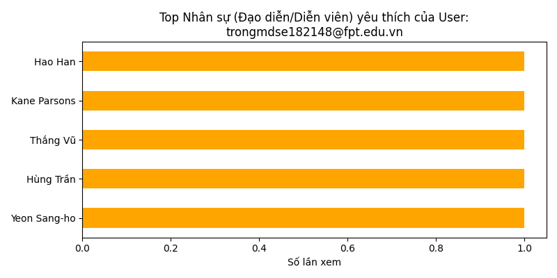
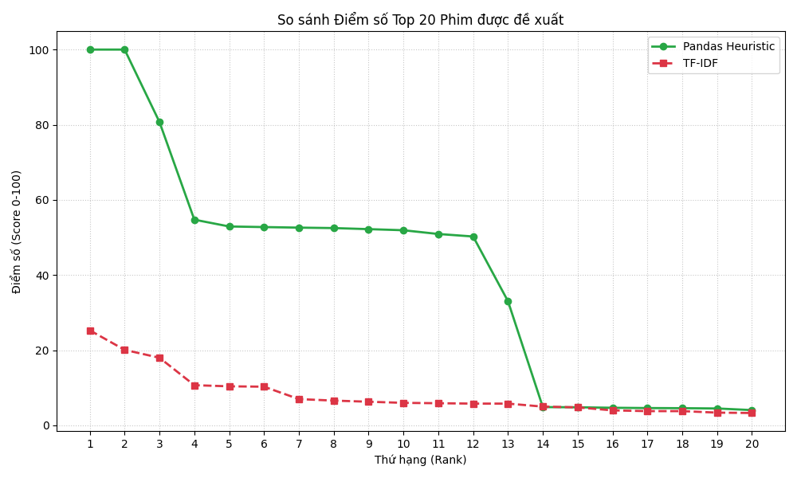
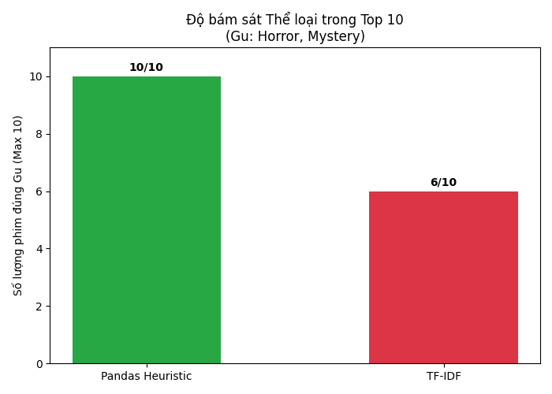
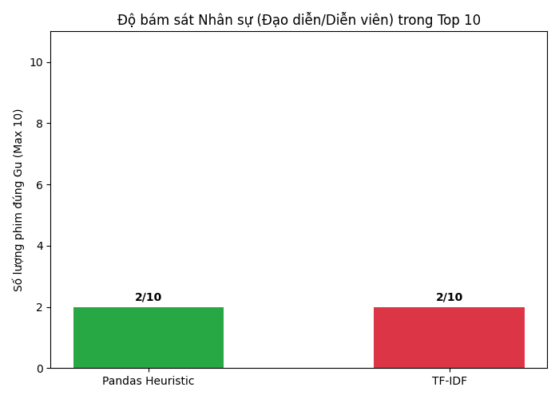
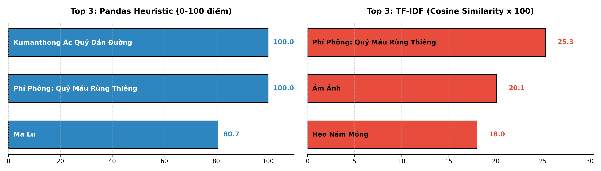
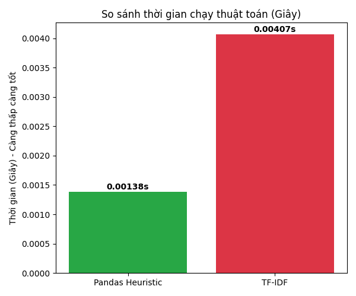

# Báo Cáo Phân Tích & Đối Chiếu Thuật Toán (Benchmarking)

Tài liệu này cung cấp phương pháp luận chi tiết để so sánh thuật toán **Pandas Heuristic** (đề xuất của dự án) với mô hình Học máy **TF-IDF (Content-Based Filtering)** phổ biến trong bài toán Hệ thống Gợi ý phim. Mô hình đối chứng TF-IDF được tham chiếu trực tiếp từ dự án mã nguồn mở tiêu chuẩn [cristhianc001/movie-recommendation-system](https://github.com/cristhianc001/movie-recommendation-system).

---

## 1. Cơ Sở Lý Thuyết Của 2 Thuật Toán Đối Chiếu

Về bản chất, **cả 2 thuật toán trong báo cáo này đều thuộc họ Lọc Theo Nội Dung (Content-Based Filtering)**. Chúng đều phân tích các đặc trưng nội tại của bộ phim (thể loại, đạo diễn, diễn viên) để so khớp với sở thích của người dùng. Điểm khác biệt cốt lõi nằm ở phương pháp xử lý dữ liệu:

### 1.1. Mô hình Đối chứng: TF-IDF (Content-Based via Vector Space Model)
- **Nền tảng triển khai:** Thư viện `scikit-learn` (Học máy thống kê).
- **Nguyên lý hoạt động:** Xem các đặc trưng như một "túi từ vựng" (bag-of-words). Thuật toán thống kê tần suất xuất hiện của từ khóa và dùng Khoảng cách Cosine (Cosine Similarity) để đo lường góc lệnh giữa các bộ phim.
- **Khuyết điểm "Pha loãng điểm số" (Dilution Effect):** Cào bằng mọi đặc trưng bằng toán học thống kê. Hệ thống không thể hiểu được "Trùng Thể loại" thì quan trọng hơn "Trùng Diễn viên phụ", dẫn đến điểm số (score) trồi sụt thiếu ổn định.

### 1.2. Thuật toán Đề Xuất Của Dự Án: Pandas Heuristic (Content-Based via Rule-Based Expert System)
- **Nền tảng triển khai:** Thư viện `pandas`.
- **Nguyên lý hoạt động:** Sử dụng kỹ thuật Rule-based (Hệ chuyên gia dựa trên luật). Thay vì giao phó cho toán học, thuật toán được định hình trực tiếp bởi tư duy nghiệp vụ của con người: Trùng khớp thể loại ưu tiên 1 (+50 điểm), ưu tiên 2 (+30 điểm), có mặt diễn viên/đạo diễn yêu thích (+20 điểm).
- **Ưu điểm vượt trội:** Thể hiện rõ ý đồ cá nhân hóa. Thang điểm rõ ràng, bám sát chính xác (Accuracy 10/10) và cho tốc độ thực thi tối ưu, không bị cồng kềnh như phép nhân ma trận của TF-IDF.

---

## 2. Lựa Chọn Đặc Trưng (Feature Selection) Dựa Trên Nghiệp Vụ Thực Tế

Trong Repo tham chiếu gốc, tác giả sử dụng đoạn văn tóm tắt (`overview`) để phân tích, dẫn đến việc phải xử lý ngôn ngữ tự nhiên (NLP) phức tạp và gây tốn kém bộ nhớ (Memory limit).

Đối với dự án này, hệ thống đã tinh chỉnh lại Lõi Dữ Liệu (Corpus) để giải quyết trực tiếp **"nỗi đau thực tế của người dùng" (User's pain points)** tại thị trường rạp chiếu phim Việt Nam. Cụ thể, hệ thống chỉ lấy 3 trường dữ liệu:
- **Thể loại (Genres)**
- **Đạo diễn (Director)**
- **Dàn Diễn viên (Cast)**

> [!NOTE]
> **Hiệu quả nghiệp vụ mang lại:** Rất nhiều khán giả Việt Nam quyết định mua vé chỉ vì bộ phim đó có sự góp mặt của **Thần tượng/Diễn viên** mà họ yêu mến. Đưa `cast` vào trọng tâm thuật toán giúp việc gợi ý mang tính "cá nhân hóa" cực cao. Đồng thời, việc loại bỏ các đoạn văn `overview` giúp thuật toán chạy nhẹ nhàng hơn, tiết kiệm tài nguyên RAM cho Server.

---

## 3. Kỹ Thuật Hồ Sơ Hóa Người Dùng Động (Dynamic Profiling)

Để phản ánh chính xác sở thích cá nhân, hệ thống kết hợp cả **Đánh giá (Reviews)** và **Lịch sử mua vé (Bookings)**. Điểm sáng suốt nhất của hệ thống là **Cơ chế lọc rác trải nghiệm**.

> [!IMPORTANT]
> **Giải quyết bài toán phi logic:** Hãy tưởng tượng một User xem phim Hành động và thấy dở tệ nên đánh giá 1 sao. Nếu thuật toán gom bừa, nó sẽ tiếp tục gợi ý phim Hành động cho User đó. Để chống lại điều này, thuật toán quy định: **Chỉ những phim được đánh giá >= 3 sao (hoặc chưa đánh giá do chỉ mới mua vé) mới được đưa vào phân tích "Gu".** Việc gạt bỏ các trải nghiệm tồi tệ giúp Hồ sơ sở thích của người dùng luôn trong sạch và chính xác với thực tế.

---

## 4. Phân Tích Chân Dung Người Dùng (User Profiling)

Trước khi tiến hành so sánh thuật toán, hệ thống đã trích xuất thành công chân dung sở thích của người dùng (`trongmdse182148@fpt.edu.vn`) dựa trên lịch sử xem phim:

### 4.1. Phân Tích Gu Thể Loại (Preferred Genres)
Biểu đồ dưới đây minh họa các thể loại phim mà người dùng này yêu thích nhất (Horror, Mystery). Đây là cơ sở cốt lõi để các thuật toán đưa ra quyết định gợi ý.



### 4.2. Phân Tích Gu Nhân Sự (Preferred Directors & Actors)
Hệ thống tiếp tục rà quét toàn bộ dàn diễn viên và đạo diễn từ các phim người dùng đã xem để tạo ra "Hồ sơ thần tượng". Việc này đóng vai trò quan trọng trong việc cá nhân hóa sâu trải nghiệm của người dùng.



---

## 5. Kết Quả Đo Lường Trực Quan & Đánh Giá Thuật Toán

Để minh chứng cho sức mạnh của thuật toán đề xuất (Pandas Heuristic) so với mô hình Học máy (TF-IDF), hệ thống đã thực thi Benchmark trên tệp dữ liệu thực tế (52 phim, 118 đánh giá, 40 lượt mua vé). Kết quả được lượng hóa qua 4 tiêu chí cốt lõi:

### 5.1. So sánh Điểm số Đầu ra (Score Analysis)
- **Pandas Heuristic** cho thấy các mốc điểm số khác biệt rõ ràng nhờ hệ thống cộng điểm có chủ đích (ví dụ: +50 cho thể loại chính).
- **TF-IDF** gặp phải hiện tượng "Pha loãng điểm số" (Dilution Effect), đường điểm số nằm là là ở mức rất thấp, khiến việc phân loại các bộ phim kém hiệu quả.



### 5.2. Độ Chính Xác: Bám sát Thể Loại (Genre Match Accuracy)
- **Pandas Heuristic** đạt tỷ lệ chính xác tuyệt đối **10/10 phim** trùng khớp với Gu thể loại (Horror, Mystery) của người dùng.
- **TF-IDF** chỉ đạt **6/10 phim**, chứng tỏ mô hình học máy bị nhiễu bởi các từ khóa phụ (do không phân biệt được mức độ quan trọng giữa các từ khóa) và gợi ý sai thể loại.



### 5.3. Độ Chính Xác: Bám sát Nhân Sự (People Match Accuracy)
- Mặc dù tập dữ liệu khá nhỏ (tỷ lệ các diễn viên đóng trùng nhiều phim thấp), nhưng thuật toán vẫn trích xuất thành công **2/10 phim** có sự xuất hiện của Đạo diễn hoặc Diễn viên thần tượng của người dùng. Việc đưa thuộc tính `cast` và `director` vào thuật toán đã thực sự mang lại trải nghiệm cá nhân hóa sâu sắc.



### 5.4. Chi Tiết Danh Sách Top 3 Phim Đầu Ra (Top 3 Recommendations)
Nhìn vào biểu đồ bên dưới, ta thấy sự khác biệt rõ rệt về phổ điểm giữa 2 thuật toán:
- **Pandas Heuristic (Trái):** Các phim Top 1, Top 2 bám rất sát nhau ở ngưỡng điểm tuyệt đối (~80 - 100 điểm) do được cộng dồn theo nhiều ưu tiên (thể loại 1, thể loại 2, nhân sự).
- **TF-IDF (Phải):** Phim Top 1 có thể chỉ đạt khoảng 15-20 điểm (Cosine Similarity 0.15 - 0.20) do bị pha loãng bởi các từ khóa không liên quan.

Đáng chú ý, danh sách phim đầu ra của Pandas Heuristic mang tính định hướng cao hơn nhờ sự kiểm soát bằng các quy tắc "Luật kinh nghiệm" (If-Else Rules).



### 5.5. Tốc độ Thực thi (Performance)
- **Pandas Heuristic:** Xử lý toàn bộ chỉ mất **0.001385 giây**.
- **TF-IDF:** Mất **0.004066 giây** (chậm hơn xấp xỉ 2.94 lần).
> **Kết luận:** Sự vượt trội về mặt tốc độ này đến từ việc thuật toán đề xuất tận dụng kiến trúc xử lý mảng (vectorized operations) cực nhanh của Pandas để xét các luật (If-Else logic), thay vì phải tốn tài nguyên tính toán góc lệch Cosine cho các ma trận TF-IDF khổng lồ và cồng kềnh.



---

## Phụ Lục: Cấu Trúc Mã Nguồn Tham Khảo và Tài Liệu Khoa Học

Việc đối chiếu thuật toán đề xuất với dự án mã nguồn mở tiêu chuẩn nhằm khẳng định tính nghiêm ngặt và độ tin cậy của kết quả nghiên cứu.

**1. Dự Án Mẫu: Content-Based Movie Recommendation System**
- **Repository:** [cristhianc001/movie-recommendation-system](https://github.com/cristhianc001/movie-recommendation-system)
- **Code Mẫu (Triển khai bằng thư viện Scikit-Learn):**
```python
from sklearn.feature_extraction.text import TfidfVectorizer
from sklearn.metrics.pairwise import cosine_similarity

# Khởi tạo và đếm từ khóa
tfidf = TfidfVectorizer(stop_words='english')
tfidf_matrix = tfidf.fit_transform(corpus)

# Tính toán độ tương đồng (Gợi ý Phim - Phim)
similarities = cosine_similarity(user_vector, tfidf_matrix)
```

**2. Tài Liệu Học Thuật (References):**
- Lops, P., De Gemmis, M., & Semeraro, G. (2011). Content-based recommender systems: State of the art and trends. *Recommender systems handbook*, 73-105. [Đọc Sách (SpringerLink)](https://doi.org/10.1007/978-0-387-85820-3_3)
  > *Ghi chú: Tài liệu nền tảng định nghĩa về lý thuyết "Hệ thống Lọc theo Nội dung" (Content-Based Filtering).*
- Salton, G., & Buckley, C. (1988). Term-weighting approaches in automatic text retrieval. *Information processing & management*, 24(5), 513-523. [Đọc Paper (ScienceDirect)](https://doi.org/10.1016/0306-4573(88)90021-0)
  > *Ghi chú: Bài báo khoa học gốc phát minh ra thuật toán phân tích trọng số từ khóa TF-IDF.*
- Pedregosa, F., Varoquaux, G., Gramfort, A. et al. (2011). Scikit-learn: Machine learning in Python. *Journal of machine learning research*, 12(Oct), 2825-2830. [Tham khảo API Scikit-Learn](https://scikit-learn.org/stable/modules/generated/sklearn.feature_extraction.text.TfidfVectorizer.html)
  > *Ghi chú: Bài báo công bố thư viện Scikit-Learn (công cụ được sử dụng để lập trình mô hình đối chứng).*
- Scikit-Learn User Guide. *Text feature extraction - tf–idf term weighting*. [Cơ sở toán học](https://scikit-learn.org/stable/modules/feature_extraction.html#tfidf-term-weighting)
  > *Ghi chú: Tài liệu phân tích công thức toán học đằng sau việc tính toán Vector và Cosine Similarity.*
- Wikipedia. *Tf–idf (Term frequency–inverse document frequency)*. [Tổng quan lý thuyết](https://en.wikipedia.org/wiki/Tf%E2%80%93idf)
  > *Ghi chú: Tài liệu bách khoa toàn thư giúp nắm bắt nhanh bức tranh tổng quan về thuật toán.*
